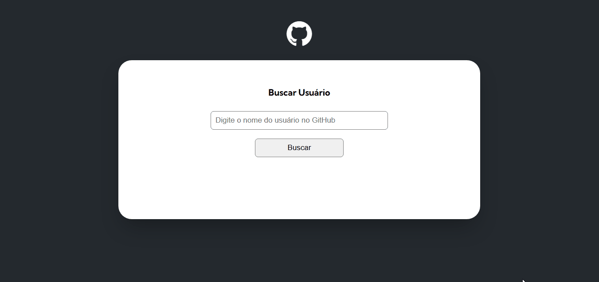

# Informações do Projeto

Página responsiva, que utiliza a API do GitHub para buscar usuários e fornecer informações na tela sobre os mesmos.

## Tecnologias Utilizadas

- HTML
- CSS
- JS

## Funcionalidades Principais

- Layout responsivo, adaptando-se bem a telas menores (smartphones/tablets).
- Exibição em tela com informações sobre os usuários do GitHub

## Resultado Final do Projeto

